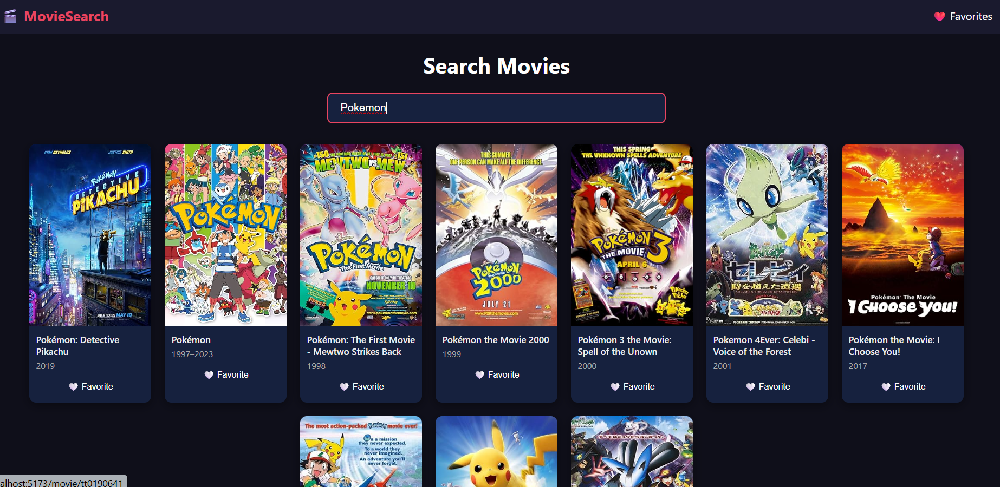

# 🎬 Movie Search App

A React.js application built during **GOW AI Academy RFT Frontend Internship - Day 14**.

## 🛠️ Tech Stack

- React.js (Vite)
- React Router DOM
- OMDb API
- Context API

## ✨ Features

- 🔍 Search movies by name
- ⏱️ Debounced API calls (500ms)
- 🖼️ Movie posters and full details
- ❤️ Add / remove favorites
- 📄 Dedicated movie detail page

## 📁 Project Structure

```txt
src/
├── components/
│   ├── Navbar.jsx
│   ├── MovieCard.jsx
│   └── Loader.jsx
├── pages/
│   ├── Home.jsx
│   ├── Favorites.jsx
│   └── MovieDetail.jsx
├── context/
│   └── FavoritesContext.jsx
├── App.jsx
├── main.jsx
└── index.css
```

## 🚀 Getting Started

### 1. Clone the repo

```bash
git clone https://github.com/Aman-Sharma-0007/RFT-INTERNSHIP-FRONTEND/tree/main/Day-14
cd movie-search-app
```

### 2. Install dependencies

```bash
npm install
```

### 3. Add your OMDb API Key

Get a free key at:

```txt
http://www.omdbapi.com/apikey.aspx
```

Replace `YOUR_API_KEY` in:

- `src/pages/Home.jsx`
- `src/pages/MovieDetail.jsx`

### 4. Run the app

```bash
npm run dev
```

## 📸 Screenshots

> 


## 📚 Concepts Learned

- Search-based API integration
- Debouncing with `useRef` + `setTimeout`
- React Router DOM (v6)
- Global state with Context API


