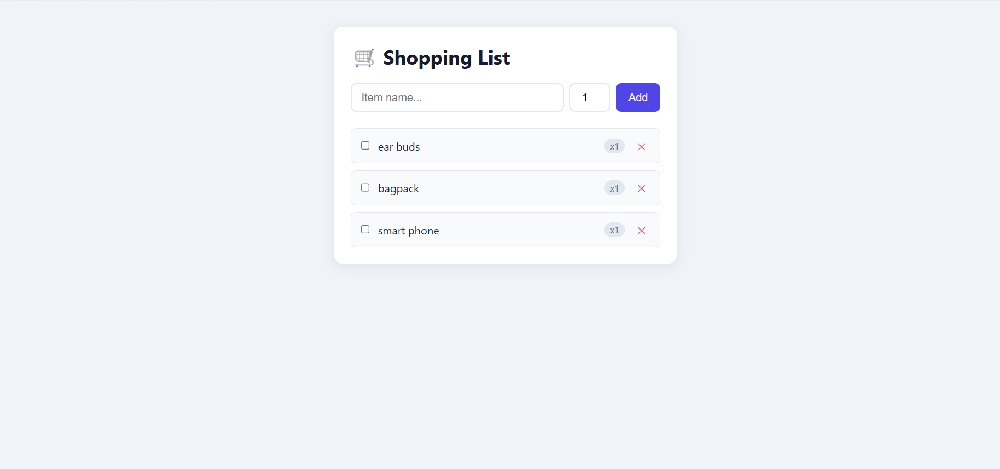

# 🛒 ShoppingListManager — Day 8

**GOW AI Academy | RFT Frontend Internship**

---

## 📌 Project Overview

A Shopping List Manager built with **React + Vite** that demonstrates state management with objects, list rendering, and input handling.

---

## 🧠 Concepts Covered

- Lists + State (`useState` with array of objects)
- Input Handling (controlled components)
- State Updates with Objects (spread operator)
- React Router DOM v6

---

## ✅ Features

- Add items with name and quantity
- Remove items from the list
- Mark items as bought (strikethrough)
- Clean, responsive UI

---

## 📁 Folder Structure

```bash
shopping-list-manager/
├── public/
├── src/
│   ├── components/
│   │   ├── AddItemForm.jsx
│   │   ├── ShoppingItem.jsx
│   │   └── ShoppingList.jsx
│   ├── pages/
│   │   └── ShoppingPage.jsx
│   ├── App.jsx
│   ├── main.jsx
│   └── index.css
├── index.html
├── package.json
└── vite.config.js
```

---

## 🚀 Getting Started

```bash
# Clone the repository
git clone https://github.com/Aman-Sharma-0007/RFT-INTERNSHIP-FRONTEND/tree/main/Day-8

# Navigate to project folder
cd shopping-list-manager

# Install dependencies
npm install

# Start development server
npm run dev
```

---

## 🛠 Tech Stack

| Tech | Usage |
|------|-------|
| React 18 | UI Library |
| Vite | Build Tool |
| React Router DOM v6 | Routing |
| CSS | Styling |

---
## 📸 Preview

> 


## 📝 Key Learnings

- How to manage a list of **objects** in state
- Using **spread operator** to update specific fields in an object without mutating state
- Lifting state up from child components to parent
- Setting up routes with `react-router-dom`

---

`#gowaiacademy #rftinternship`